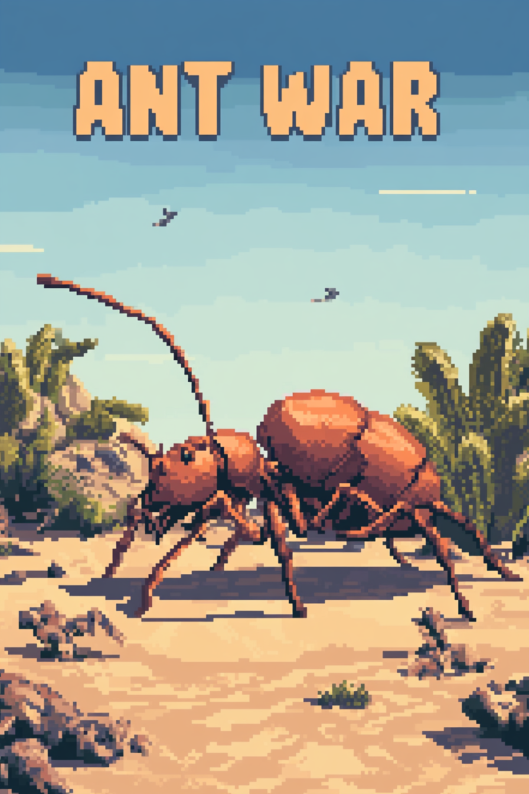

# 🐜 Ant War

A top-down real-time ant colony strategy game built with [Phaser 3](https://phaser.io/). Command your colony, gather resources, build your army, and destroy the enemy mound across 8 increasingly difficult campaign missions.



---

## Installation

Ant War runs directly in the browser — no build step or dependencies required.

### Option 1: Direct file open

```bash
# Simply open index.html in any modern browser
open index.html
# or
xdg-open index.html       # Linux
start index.html           # Windows
```

### Option 2: Local dev server (recommended)

```bash
cd src/ant-war

# Python (any version)
python3 -m http.server 8080

# Or Node.js
npx serve .

# Then open
# http://localhost:8080
```

### Requirements

- Any modern browser (Chrome, Firefox, Edge, Safari)
- Phaser 3.60.0 is loaded from CDN — no npm install needed

---

## How to Play

### Goal

Destroy the enemy ant mound at the top of the screen before they destroy yours at the bottom.

### Controls

- **Tap/click** powerup buttons on the right side of the screen to buy units and abilities
- All other actions (ant movement, combat, gathering) happen automatically

### Economy

- **Gatherer Ants** collect food (green dots) scattered across the field and return it to your mound
- Each food pickup grants resources (shown in the top-left)
- Spend resources on powerups via the buttons on the right

### Powerups

| Unit | Cost | Description |
|------|------|-------------|
| **Gatherer** | 15 | Collects food for resources. Cannot be killed in combat. Max 10 purchasable. |
| **Fighter** | 30 | Attacks the enemy mound and fights enemy ants. Two fighters kill each other on contact. Max 10 purchasable. |
| **Mega Fighter** | 50 | Destroys normal fighters on contact. Only killed by other Mega Fighters (both die). |
| **Sand Bomb** | 100 | Instantly deals 50 damage to the enemy mound with a visual tornado effect. |

### Combat Rules

- **Fighter vs Fighter** → both die
- **Mega vs Fighter** → Fighter dies
- **Mega vs Mega** → both die
- **Gatherers** → completely ignore all combat, never die from ant contact
- Any fighter/mega reaching the enemy mound deals its damage and is destroyed

---

## Campaign Levels

The game features 8 campaign missions that unlock sequentially. Each level introduces harder AI behavior, stronger enemies, and tighter economies.

### Level 1 — Scout Patrol ★☆☆☆☆

> *The enemy is testing your defenses. Stay sharp, Commander.*

A gentle introduction. The AI starts weak and buys units cautiously.

| Parameter | Value |
|-----------|-------|
| Player HP | 100 |
| Enemy HP | 70 |
| Your starting army | 2 Fighters, 1 Gatherer |
| Enemy starting army | 2 Fighters, 1 Gatherer |
| Enemy Megas | 0 |
| Fighter spawn rate | Every 10s |
| AI aggressiveness | Low |

### Level 2 — Foraging Rights ★★☆☆☆

> *They are hoarding resources. Out-collect them before they overwhelm you.*

The AI starts with resources and more gatherers, giving it an economic head start.

| Parameter | Value |
|-----------|-------|
| Player HP | 100 |
| Enemy HP | 90 |
| Your starting army | 2 Fighters, 1 Gatherer |
| Enemy starting army | 3 Fighters, 2 Gatherers |
| Enemy Megas | 0 |
| Enemy starting resources | 10 |
| Fighter spawn rate | Every 9s |
| AI aggressiveness | Normal |

### Level 3 — Territory War ★★★☆☆

> *They have dug in. Your fighters won't be enough — build your army.*

The enemy mound is tougher and the AI starts spending more aggressively.

| Parameter | Value |
|-----------|-------|
| Player HP | 100 |
| Enemy HP | 120 |
| Your starting army | 3 Fighters, 1 Gatherer |
| Enemy starting army | 4 Fighters, 2 Gatherers |
| Enemy Megas | 0 |
| Enemy starting resources | 15 |
| Fighter spawn rate | Every 8s |
| AI aggressiveness | Normal+ |

### Level 4 — Colony Defense ★★★☆☆

> *The enemy has bred Mega Fighters. You need heavy hitters of your own.*

First appearance of enemy Mega Fighters. You'll need your own Megas to counter.

| Parameter | Value |
|-----------|-------|
| Player HP | 100 |
| Enemy HP | 130 |
| Your starting army | 2 Fighters, 2 Gatherers |
| Enemy starting army | 3 Fighters, 2 Gatherers, 1 Mega |
| Enemy starting resources | 20 |
| Fighter spawn rate | Every 7s |
| AI aggressiveness | High |

### Level 5 — Desert Storm ★★★★☆

> *The enemy commands the sands themselves. Prepare for bombardment.*

The AI starts using Sand Bombs and food becomes scarcer.

| Parameter | Value |
|-----------|-------|
| Player HP | 100 |
| Enemy HP | 150 |
| Your starting army | 3 Fighters, 1 Gatherer |
| Enemy starting army | 4 Fighters, 2 Gatherers, 1 Mega |
| Enemy starting resources | 30 |
| Fighter spawn rate | Every 6s |
| Food value per pickup | 4 (down from 5) |
| AI Sand Bomb chance | ~20% per decision |
| AI aggressiveness | High+ |

### Level 6 — Siege of the Hive ★★★★☆

> *They have superior numbers and relentless attacks. Hold the line.*

Everything scales up. More enemies, faster spawns, tighter economy.

| Parameter | Value |
|-----------|-------|
| Player HP | 120 |
| Enemy HP | 180 |
| Your starting army | 3 Fighters, 2 Gatherers |
| Enemy starting army | 5 Fighters, 3 Gatherers, 2 Megas |
| Enemy starting resources | 40 |
| Fighter spawn rate | Every 5s |
| Food value per pickup | 4 |
| Max food on field | 16 |
| AI aggressiveness | Very High |

### Level 7 — Queen's Gambit ★★★★★

> *Only the most cunning strategies will survive. Every move counts.*

The AI floods the field. Resources are scarce and every purchase matters.

| Parameter | Value |
|-----------|-------|
| Player HP | 130 |
| Enemy HP | 200 |
| Your starting army | 3 Fighters, 2 Gatherers |
| Enemy starting army | 5 Fighters, 3 Gatherers, 3 Megas |
| Enemy starting resources | 50 |
| Fighter spawn rate | Every 4.5s |
| Food value per pickup | 3 (down from 5) |
| Max food on field | 14 |
| AI aggressiveness | Extreme |

### Level 8 — Apocalypse ★★★★★

> *The final battle. Give them everything you've got, Commander.*

The ultimate challenge. Maxed-out AI with rapid spawns and constant pressure.

| Parameter | Value |
|-----------|-------|
| Player HP | 150 |
| Enemy HP | 250 |
| Your starting army | 4 Fighters, 2 Gatherers |
| Enemy starting army | 6 Fighters, 4 Gatherers, 4 Megas |
| Enemy starting resources | 60 |
| Fighter spawn rate | Every 4s |
| Food value per pickup | 3 |
| Max food on field | 15 |
| AI decision speed | Every 1.2s |
| AI aggressiveness | Maximum |

---

## Difficulty Scaling Summary

As you progress through levels, the AI gets:

- **Tougher mounds** — from 70 HP (Level 1) to 250 HP (Level 8)
- **More starting units** — from 3 ants (Level 1) to 14 ants including 4 Megas (Level 8)
- **Faster spawns** — fighter auto-spawn interval drops from 10s to 4s
- **Faster decisions** — AI thinks every 3s (Level 1) down to 1.2s (Level 8)
- **More aggressive buying** — probability multipliers increase ~2.25x from Level 1 to 8
- **More Sand Bombs** — AI bomb chance goes from 5% to 35%
- **Scarcer food** — food value drops from 5 to 3 resources, max food on field shrinks
- **Head start** — AI begins with up to 60 resources on the later levels

### Tips for Higher Levels

1. **Invest in Mega Fighters** — they hard-counter the AI's fighter spam
2. **More Gatherers early** — the economy squeeze on later levels makes every food count
3. **Save for Sand Bombs** — when the enemy mound has 200+ HP, direct damage is efficient
4. **Don't neglect defense** — a dead mound means game over regardless of army size
5. **Balance your army** — pure fighters get eaten by Megas, pure Megas are expensive to replace

---

## Project Structure

```
src/ant-war/
├── index.html                     # Entry point
├── js/
│   ├── main.js                    # Phaser config and game initialization
│   ├── utils/
│   │   ├── constants.js           # Game constants (speeds, damage, costs)
│   │   ├── levels.js              # Level definitions (8 missions)
│   │   └── utils.js               # String utilities
│   ├── entities/
│   │   ├── Ant.js                 # Base ant class (movement, rotation, destruction)
│   │   ├── FighterAnt.js          # Fighter ant (attacks enemy mound)
│   │   ├── GathererAnt.js         # Gatherer ant (collects food)
│   │   ├── MegaFighterAnt.js      # Mega fighter (destroys normal fighters)
│   │   ├── Food.js                # Food pickup entity
│   │   ├── Mound.js               # Colony mound (health, resources, spawning)
│   │   └── PowerupButton.js       # UI button for buying units
│   └── scenes/
│       ├── PreloadScene.js        # Asset loading with progress bar
│       ├── HomeScene.js           # Main menu with volume controls
│       ├── LevelSelectScene.js    # Mission picker (2x4 grid)
│       ├── GameScene.js           # Core gameplay
│       ├── LevelCompleteScene.js  # Victory screen with progression
│       └── GameOverScene.js       # Defeat screen with retry
└── assets/                        # Sprites, sounds, and backgrounds
    ├── audio/                     # Music and sound effects
    └── *.png                      # Game sprites
```

---

## Tech Stack

- **Phaser 3.60.0** — 2D game framework (loaded via CDN)
- **Arcade Physics** — collision detection and movement
- **Vanilla JavaScript** — no build tools, no transpilation
- **HTML5 Canvas/WebGL** — renders in any modern browser

---

## License

MIT
